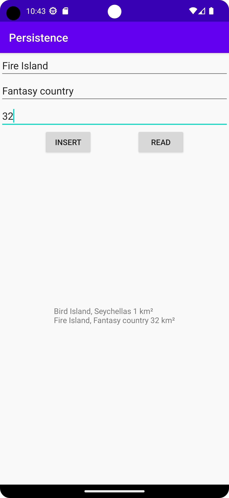
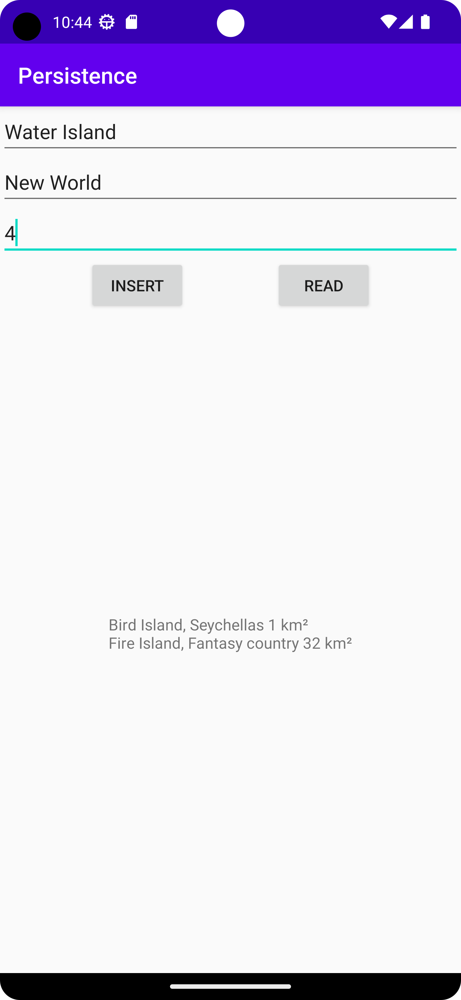
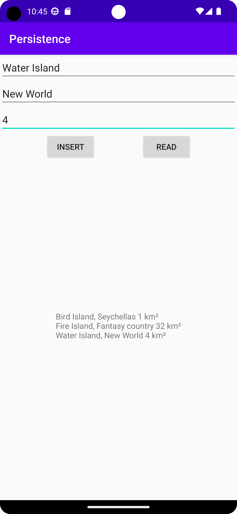

# Rapport

** För att skapa egna tabeller användes metoder för att hämta värdet i textredigering objekten.
Dessa sattes sedan in i databastabellen med hjälp av en knapp och DatabaseHelper klassen. För
att sedan visa tabellen användes en knapp för att skapa en ny vy på tabellen, med hjälp av en cursor 
och en while-iteration skriver man ut resultatet i databasen. Resultatet skrivs sedan ut i text vyn.
som loopar alla och skriver ut. (se Kodsegment 1, 2 & skärmdumpar) **


# Kodsegment 1:
```
// Insert rows to table
        addButton.setOnClickListener(new View.OnClickListener() {
            @Override
            public void onClick(View v) {
                EditText islandName = findViewById(R.id.editName);
                EditText islandLocation = findViewById(R.id.editLocation);
                EditText islandSize = findViewById(R.id.editSize);

                String name = islandName.getText().toString();
                String location = islandLocation.getText().toString();
                String size = islandSize.getText().toString();

                try (DatabaseHelper databaseHelper = new DatabaseHelper(getApplicationContext());
                     SQLiteDatabase database = databaseHelper.getWritableDatabase()) {

                    ContentValues values = new ContentValues();
                    values.put(DatabaseTables.Island.COLUMN_NAME_NAME, name);
                    values.put(DatabaseTables.Island.COLUMN_NAME_LOCATION, location);
                    values.put(DatabaseTables.Island.COLUMN_NAME_SIZE, size);

                    long newTableRow = database.insert(DatabaseTables.Island.TABLE_NAME, null, values);
                }
            }
        });
```
# Kodsegment 2:
```
// Display Table
        Button readTableButton = findViewById(R.id.readButton);
        readTableButton.setOnClickListener(new View.OnClickListener() {
            @Override
            public void onClick(View v){
                DatabaseHelper databaseHelper = new DatabaseHelper(getApplicationContext());
                SQLiteDatabase database = databaseHelper.getReadableDatabase();

                Cursor cursor = database.query(DatabaseTables.Island.TABLE_NAME,
                        null,
                        null,
                        null,
                        null,
                        null,
                        null
                );

                StringBuilder tableContent = new StringBuilder();

                while (cursor.moveToNext()) {
                    String columnName = cursor.getString(cursor.getColumnIndexOrThrow(DatabaseTables.Island.COLUMN_NAME_NAME));
                    String columnLocation = cursor.getString(cursor.getColumnIndexOrThrow(DatabaseTables.Island.COLUMN_NAME_LOCATION));
                    String columnSize = cursor.getString(cursor.getColumnIndexOrThrow(DatabaseTables.Island.COLUMN_NAME_SIZE));
                    tableContent.append(columnName).append(", ").append(columnLocation).append(" ").append(columnSize).append(" km²").append("\n");
                }
                cursor.close();
                database.close();

                TextView islandTextView = findViewById(R.id.viewTable);
                islandTextView.setText(tableContent.toString());
            }
        });
```




